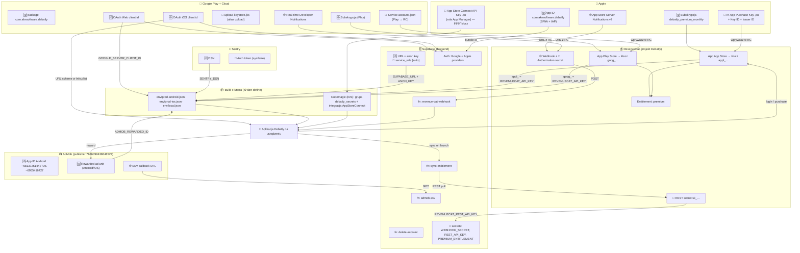

# Debatly — mapa kluczy, produktów i połączeń

Kto z kim gada, jaki klucz gdzie powstaje i gdzie ląduje. Jedna prawda o
"web zależności" między konsolami. Uzupełnia (nie zastępuje)
[RELEASE_CHECKLIST.md](RELEASE_CHECKLIST.md) i
[IOS_RELEASE_CHECKLIST.md](IOS_RELEASE_CHECKLIST.md) — tam są kroki „kliknij tu”,
tu jest obraz całości.

## Legenda

| Symbol | Znaczenie |
| --- | --- |
| 🆔 | Identyfikator (bundle/package, product id, client id, app id) — jawny, nie sekret |
| 🔑 | Sekret (klucz API, hasło) — trzymany poza gitem |
| 📄 | Plik-poświadczenie do wgrania w konsoli (`.p8`, service-account `.json`, `.jks`) |
| 🌐 | URL / callback wpinany w cudzą konsolę |
| ⚙️ | `--dart-define` wstrzykiwany do buildu Fluttera |
| ☁️ | Ustawiane w panelu (dashboard), nie w kodzie |

---

## 0. Jeden identyfikator spina wszystko: `com.aknsoftware.debatly`

Ten sam string to jednocześnie: **Bundle ID** (Apple), **package name** (Android/Play),
**App ID** (Apple Developer), tożsamość podpisu Codemagic, tożsamość apki w RevenueCat
i identyfikator dla Apple sign-in. Jak gdzieś się rozjedzie — subskrypcje/logowanie
przestają działać po cichu. Nigdy go nie zmieniaj.

Drugi „spinacz”: **`auth.uid()` z Supabase == `app_user_id` w RevenueCat == `user_id` w SSV**.
Realizuje to `Purchases.logIn(supabaseUserId)` w apce. Dzięki temu webhook RC i callback
AdMob wiedzą, którego użytkownika Supabase dotyczy zdarzenie.

---

## 1. Widok z lotu ptaka

> Na GitHubie diagram wyżej renderuje się jako grafika. W innym edytorze zobaczysz
> tekst Mermaid — sama wizualna mapa jest też w odpowiedzi asystenta w oknie czatu.

---

## 2. Gdzie co tworzysz (inwentarz per konsola)

### 🍎 Apple — developer.apple.com + App Store Connect
| Artefakt | Gdzie powstaje | Dokąd idzie |
| --- | --- | --- |
| 🆔 App ID `com.aknsoftware.debatly` (SIWA + IAP) | developer.apple.com → Identifiers | podstawa profilu podpisu + Apple sign-in |
| 🆔 Subskrypcja np. `debatly_premium_monthly` | ASC → Monetization → Subscriptions | wpisujesz **identyczny** Product ID w RevenueCat |
| 📄 **In-App Purchase Key** `.p8` (+ Key ID + Issuer ID) | ASC → Users and Access → Integrations → In-App Purchase | **wgrywasz do RevenueCat** (app App Store). Pobierasz TYLKO RAZ |
| 📄 **App Store Connect API Key** `.p8` (rola App Manager) | ASC → Users and Access → Integrations → App Store Connect API | **do Codemagic** (build/upload). To **INNY** klucz niż wyżej! |
| 🌐 App Store Server Notifications (v2, prod+sandbox) | ASC → App Information | URL kopiujesz **z RevenueCat** |
| ☁️ Paid Apps Agreement + bank + podatki (W-8BEN) | ASC → Business | bez „Active” subskrypcje **nie pobiorą się** nawet w sandboxie |

### 🤖 Google Play + Google Cloud
| Artefakt | Gdzie powstaje | Dokąd idzie |
| --- | --- | --- |
| 🆔 package `com.aknsoftware.debatly` + subskrypcja | Play Console → Monetize → Products | Product ID → RevenueCat (ten sam schemat nazw co Apple) |
| 📄 **Service account `.json`** (poświadczenia Play) | Google Cloud → IAM → Service accounts (+ dostęp w Play Console) | **wgrywasz do RevenueCat** (app Play Store) — to on „ściąga produkty” i weryfikuje zakupy |
| 🌐 Real-time Developer Notifications (Pub/Sub) | Play Console → Monetization setup | temat kieruje do RevenueCat (androidowy odpowiednik ASN) |
| 📄 `upload-keystore.jks` (alias `upload`) + `key.properties` | lokalnie (`keytool`), git-ignored | podpis App Bundle. **Zgubisz = koniec aktualizacji apki**. Zrób backup |
| 🆔 OAuth **Web** client id | Google Cloud → Credentials | `GOOGLE_SERVER_CLIENT_ID` ⚙️ **oraz** Supabase Authorized Client IDs |
| 🆔 OAuth **iOS** client id | Google Cloud → Credentials | URL scheme w `ios/Runner/Info.plist` **oraz** Supabase Authorized Client IDs |
| 🆔 OAuth **Android** client (SHA-1 podpisu) | Google Cloud → Credentials | tylko rejestracja odcisku podpisu; nie trafia do kodu |

### 📺 AdMob (jeden publisher: `7626099438648527`)
| Artefakt | Wartość / gdzie | Dokąd idzie |
| --- | --- | --- |
| 🆔 App ID Android | `ca-app-pub-7626099438648527~5813725144` | `AndroidManifest.xml` (już wpisane ✅) |
| 🆔 App ID iOS | `ca-app-pub-7626099438648527~6955416427` | `ios/Runner/Info.plist` (już wpisane ✅) |
| 🆔 Rewarded ad unit (osobny dla Android i iOS) | AdMob → Apps → Ad units → Rewarded | `ADMOB_REWARDED_ID` ⚙️ (Android w prod-android, iOS w prod-ios) |
| 🌐 **SSV callback URL** | `https://<ref>.functions.supabase.co/admob-ssv` | wklejasz na ad unicie (Advanced → Server-side verification). Bez tego **żaden reveal-by-ad się nie zweryfikuje** |
| test unit Android / iOS | `…3940256099942544/5224354917` / `…/1712485313` | domyślne w kodzie, na czas devu |

### 💰 RevenueCat (projekt „Debatly”) — węzeł, który wszystko zbiera
| Artefakt | Skąd bierze / co robi | Dokąd wychodzi |
| --- | --- | --- |
| App **App Store** | Bundle ID + wgrany 📄 `.p8` IAP + Key ID + Issuer ID | daje **Public API Key `appl_…`** |
| App **Play Store** | package + wgrany 📄 service-account `.json` | daje **Public API Key `goog_…`** |
| Public API Key `appl_…` / `goog_…` | — | `REVENUECAT_API_KEY` ⚙️ (iOS build używa `appl_`, Android `goog_`) |
| Products + **Entitlement `premium`** + Offerings | podpinasz produkty Apple **i** Google pod ten jeden entitlement | `premium` == `profiles.is_premium` w Supabase |
| 🔑 **REST secret key `sk_…`** | API keys → Secret | Supabase secret `REVENUECAT_REST_API_KEY` (dla `sync-entitlement`) |
| 🌐 **Webhook** + 🔑 Authorization secret | Integrations → Webhooks → URL do Supabase | patrz pułapka o myślniku niżej |

### 🗄️ Supabase (backend + serwerowa prawda o premium)
| Artefakt | Wartość | Dokąd idzie |
| --- | --- | --- |
| 🆔 `SUPABASE_URL` + 🔑 `SUPABASE_ANON_KEY` | Project settings → API | `⚙️` do buildu (klient) |
| 🔑 `service_role` key | — | **auto-wstrzykiwany** do edge functions; nigdy do apki |
| Edge fn `revenue-cat-funkcje` | `revenue-cat-webhook` (RC push), `admob-ssv` (GET), `sync-entitlement` (JWT, pull), `delete-account` (JWT) | patrz [supabase/functions/README.md](supabase/functions/README.md) |
| 🔑 secrets | `REVENUECAT_WEBHOOK_SECRET`, `REVENUECAT_REST_API_KEY`, `PREMIUM_ENTITLEMENT` (domyślnie `premium`) | `supabase secrets set …` |
| ☁️ Auth providers | Google → Authorized Client IDs (Web **+** iOS client id); Apple → `com.aknsoftware.debatly` | dashboard, nie migracja |

### 🐞 Sentry
| Artefakt | Wartość | Dokąd idzie |
| --- | --- | --- |
| 🆔 DSN | Settings → Client Keys (DSN) | `SENTRY_DSN` ⚙️ (puste = Sentry wyłączony, apka działa) |
| 🔑 Auth token | do uploadu symboli | `SENTRY_AUTH_TOKEN` (patrz `SENTRY_SETUP.md` §5) |

### 🏗️ Codemagic (build iOS bez Maca)
| Artefakt | Wartość |
| --- | --- |
| Integracja `AppStoreConnect` | 📄 App Store Connect API Key `.p8` (App Manager) — nazwa **musi** = `codemagic.yaml` |
| Grupa env `debatly_secrets` (każde jako Secure) | `SUPABASE_URL`, `SUPABASE_ANON_KEY`, `REVENUECAT_API_KEY_IOS` (`appl_…`), `ADMOB_REWARDED_ID_IOS`, `GOOGLE_SERVER_CLIENT_ID`, `SENTRY_DSN` |
| Podpis | `ios_signing.bundle_identifier: com.aknsoftware.debatly` (Codemagic sam robi cert + profil) |

---

## 3. Przepływy krytyczne

**A. Subskrypcja iOS:** produkt w ASC → ten sam Product ID w RC (app App Store, uwierzytelniona `.p8` IAP) → entitlement `premium` → klucz `appl_` w buildzie → user kupuje → apka woła `sync-entitlement` (pull po REST `sk_`) **i** RC śle webhook → `profiles.is_premium=true`.

**B. Subskrypcja Android:** analogicznie, ale poświadczenie w RC to service-account `.json`, klucz publiczny to `goog_`, powiadomienia to RTDN zamiast ASN.

**C. Reklama z nagrodą:** apka pokazuje rewarded unit z `userId = auth.uid()` → Google woła `admob-ssv` (weryfikuje podpis ECDSA, loguje) → apka wywołuje RPC `reveal_ad_question` (to on faktycznie odsłania pytanie).

**D. Google sign-in:** Web client id (`GOOGLE_SERVER_CLIENT_ID`) → natywne logowanie zwraca ID token → Supabase go weryfikuje (Web **i** iOS client id muszą być w Authorized Client IDs).

**E. Apple sign-in:** capability SIWA na App ID → entitlement w `Runner.entitlements` → provider Apple w Supabase z bundle id `com.aknsoftware.debatly` (natywny flow nie potrzebuje Services ID ani secretu).

---

## 4. Gdzie każdy klucz ląduje w kodzie

**Klient (`--dart-define`, `lib/core/config/app_config.dart`, pliki `env/*.json`):**
`SUPABASE_URL`, `SUPABASE_ANON_KEY`, `GOOGLE_SERVER_CLIENT_ID`, `REVENUECAT_API_KEY`
(`appl_`/`goog_` zależnie od platformy), `ADMOB_REWARDED_ID`, `ADMOB_TEST_DEVICE_IDS`,
`SENTRY_DSN`, `SENTRY_ENVIRONMENT`, `SENTRY_TRACES_SAMPLE_RATE`, `PRIVACY_POLICY_URL`,
`TERMS_OF_SERVICE_URL`, `DELETE_ACCOUNT_URL`. Wzór: [env/example.json](env/example.json).

**Serwer (Supabase secrets):** `REVENUECAT_WEBHOOK_SECRET`, `REVENUECAT_REST_API_KEY`,
`PREMIUM_ENTITLEMENT` (opcjonalnie), plus auto `SUPABASE_SERVICE_ROLE_KEY` / `SUPABASE_URL`.

**Native (w repo, już wpisane):** AdMob App ID w `AndroidManifest.xml` i `Info.plist`;
OAuth iOS URL scheme w `Info.plist`; `Runner.entitlements` (SIWA).

---

## 5. Pułapki (tu ludzie tracą godziny)

1. **Dwa różne pliki `.p8` od Apple.** In-App Purchase Key → **RevenueCat**. App Store
   Connect API Key (rola App Manager) → **Codemagic**. To NIE ten sam klucz. Każdy
   pobierasz tylko raz i każdy ma własne Key ID + Issuer ID.
2. **Myślnik w slugu webhooka.** Live funkcja to `revenue-cat-webhook` (z myślnikiem),
   a folder w repo to `revenuecat-webhook`. RC musi wskazywać na wersję z myślnikiem —
   inaczej 404 i odnowienia/anulacje/zwroty **po cichu przestają się synchronizować**
   (pierwszy zakup i tak zadziała przez `sync-entitlement`, więc łatwo przeoczyć).
3. **REST key degraduje po cichu.** Bez `REVENUECAT_REST_API_KEY` `sync-entitlement`
   zwraca 200, ale bez reconciliacji — poleganie na samym „200 OK” jest mylące.
   Potwierdź, że sekret **jest ustawiony**.
4. **Grace SSV to limit dożywotni, nie dzienny.** `reveal_ad_question` ma `c_grace=2` —
   pierwsze 2 odsłony przez reklamę udają się nawet przy zepsutym SSV, potem każda pada.
   QA musi obejrzeć **≥3 reklamy** na jednym koncie i potwierdzić, że 3. odsłania.
5. **Product ID jest nieodwracalny** (Apple i Google). Ustal jeden schemat nazw i użyj
   go identycznie w obu sklepach oraz w RevenueCat.
6. **Paid Apps Agreement / bank / podatki** — bez statusu Active pusty paywall nawet
   w sandboxie. Najczęstsza przyczyna „nie pobierają się produkty”.
7. **Backup `upload-keystore.jks`** — utrata = brak możliwości aktualizacji apki pod tym
   listingiem Play.
